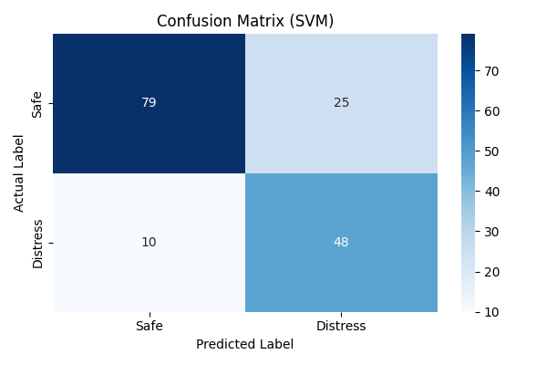
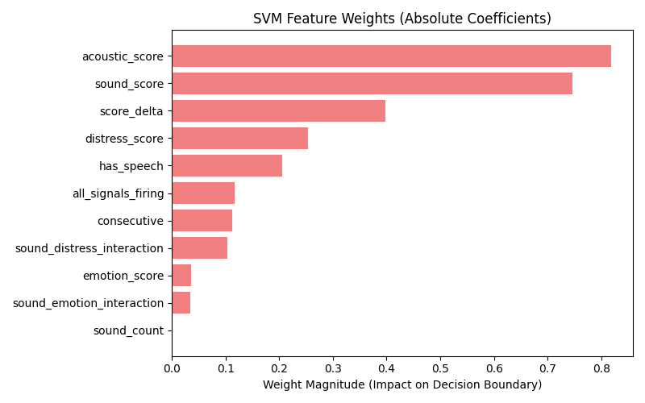

# Acoustic Distress Detection: Model Evaluation Report
**Generated on:** 2026-04-26 18:52:28

## 1. Dataset Overview
* **Total Samples Processed:** 808
* **Features Extracted per Sample:** 11
* **Training / Test Split:** 80% / 20%
* **Data Skewness Addressed:** Yes (See Model Architecture)

## 2. Model Architecture
The final decision layer has been updated to a **Support Vector Machine (SVM)** with a `linear` kernel.
This change was made specifically to address **class skewness** in the dataset.

To ensure the model does not ignore the minority "Distress" class, two critical steps were taken:
1. **`StandardScaler`**: All meta-features were normalized before training, as SVM is a distance-based algorithm.
2. **`class_weight='balanced'`**: The SVM was instructed to heavily penalize misclassifications of the minority class, forcing the decision boundary to account for the skewness.

## 3. Performance Metrics
* **Overall Accuracy:** 78.40%
* **Distress F1-Score:** 0.73 *(Primary metric for skewed data)*

### Detailed Classification Report
| Metric | Precision | Recall | F1-Score | Support |
| :--- | :---: | :---: | :---: | :---: |
| Safe (0) | 0.89 | 0.76 | 0.82 | 104 |
| Distress (1) | 0.66 | 0.83 | 0.73 | 58 |

## 4. Visual Analysis

### Confusion Matrix

*The Confusion Matrix shows the True Positives, True Negatives, False Positives, and False Negatives.*

### Feature Weights

*Unlike tree-based models, SVMs use coefficients. This chart shows the absolute value of the linear coefficients, indicating which features pushed the decision boundary the hardest.*

### Feature Ranking Breakdown
* **acoustic_score**: 0.818
* **sound_score**: 0.746
* **score_delta**: 0.398
* **distress_score**: 0.254
* **has_speech**: 0.205
* **all_signals_firing**: 0.116
* **consecutive**: 0.113
* **sound_distress_interaction**: 0.104
* **emotion_score**: 0.036
* **sound_emotion_interaction**: 0.035
* **sound_count**: 0.000

---
*Report automatically generated by Colab Pipeline.*
